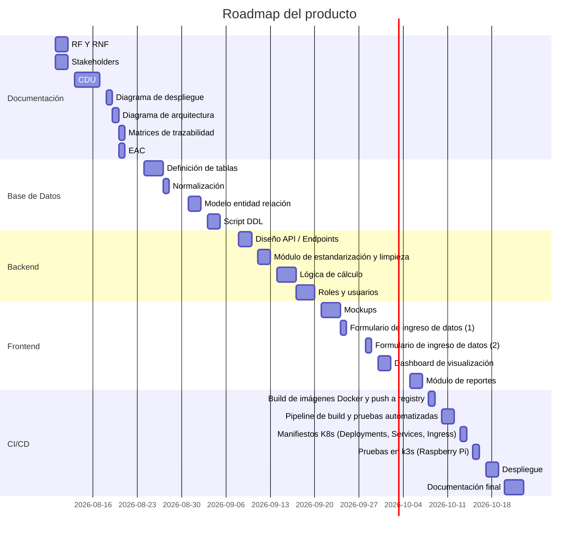

# **SICEE: Sistema Integrado de Caracterización Energetica y Emisiones**

## Descripcion del Problema

#### Planteamiento del Problema

En la actualidad en la seccion de tecnologia de la madera la cual forma parte del centro de investigacion de ingenieria (CII), cuenta con un laboratorio para la caracterización de estufas, donde lleva a cabo evaluaciones en entornos controlados utilizando estufas para medir la eficiencia térmica y el nivel de emisiones generadas. Sin embargo, la captura de los datos experimentales (como temperatura, tiempo y gases) se realiza de forma completamente manual, para su posterior digitalizacion en hojas de cálculo de Excel. Lo que da lugar a cometer errores humanos por digitalización o perdida de datos durante las pruebas realizadas, asi mismo la falta de una plataforma centralizada impide la visualización de variables en tiempo real, retrasa la generación de reportes analíticos y limita el procesamiento inmediato de grandes volúmenes de información; restando agilidad a los procesos de investigación del centro.

#### Descripcion de la Solución del Problema
Se propone realizar un sistema de software de automatización para la adquisición, almacenamiento y procesamiento de datos generados en los ensayos. Esta solución ayudara en la optimización de tiempo de ánalisis, garantizara la integridad de los resultados científicos y permitira al departamento contar con un historico digital confiable para futuros estudios. 

#### Detalles tecnicos de la Solución
Se propone realizar una solución de software la cual poseera una arquitectura en capas, las cuales se distribuiran principalmente en 3:
* **Capa de visualización**
Dashboard para ingreso y visualización de los parametros a medir y de las graficas solicitadas, al igual visualización de los datos del investigador.
* **Capa de logica del negocio** 
Logica del negocio donde se realizaran principalmente los calculós matematicos, consumo de datos del investigador y limpieza de datos.
* **Capa de almacenamiento de datos**
Base de datos donde se almacenan los datos del investigador, reportes, historial de calculos obtenidos.

---

## Justificación

El Centro de Investigación de Ingeniería (CII) desempeña un rol fundamental en la generacion de conocimiento cientifico aplicado, particularmente en el área de estudios de la madera, donde los ensayos de eficiencia termica y emisiones constituyen una fuente de datos critica para la evaluación de estufas y procesos de combustión. Sin embargo, la dependencia de procesos manuales para la captura y digitalización de estos datos compromete la calidad e integridad de la información generada, exponiendo al centro a riesgos como pérdida de datos, errores de transcripción y demoras en la disponibilidad de resultados.

La implementación de un sistema de software especializado para la gestión de estos ensayos representa una mejora significativa en la capacidad operativa del CII, al eliminar la duplicidad de esfuerzos entre la captura en campo y su posterior digitalización, reduciendo asi el margen de error humano y asegurando la trazabilidad de los datos desde su origen. Asimismo, contar con una plataforma centralizada permitiria a los investigadores acceder a información historica de manera agíl, generar reportes analíticos de forma automatizada y disponer de datos estandarizados y confiables para la toma de decisiones y la elaboracion de futuras publicaciones o estudios comparativos.

Desde una perspectiva acádemica, este proyecto permite aplicar conociemientos de ingeniería de software a un problema real dentro de un entorno de investigación universitario, generando una solución de utilidad directa para el CII y sentando las bases para futuras integraciones tecnológicas dentro del centro, como la eventual incorporación de sensores para automatizar aun mas la captura de datos.

--- 

## Objetivos

#### Objetivo General 
Desarrollar una solución de software para la automatización de procesamiento y almacenamiento de datos obtenidos durante los ensayos de eficiencia térmica y nivel de emisiones generadas por estufas, en el area de estudios de la madera del Centro de Investigación de Ingeniería (CII).

#### Objetivos Específicos
* Diseñar una interfaz de usuario amigable que permita ingresar de forma estructurada datos experimentales sustituyendo hojas de excel.
* Generar reportes de forma automatizada que faciliten su interpretación.
* Implementar un módulo de limpieza y estandarización de datos que valide la información ingresada y minimice inconsistencias antes de su procesamiento.
* Automatizar cálculos en base a los datos obtenidos en los ensayos.
* Diseñar una base de datos que almacene de forma centralizada el histórico.

--- 

## Cronograma de Actividades

## Bibliografía

Alianza Mundial para Estufas Limpias. (2014). Prueba de ebullición de agua (WBT versión 4.2.3). 
    http://www.cleancookstoves.org/our-work/standards-and-testing/learn-about-testing-protocols/
