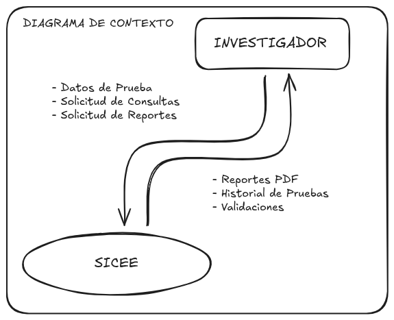
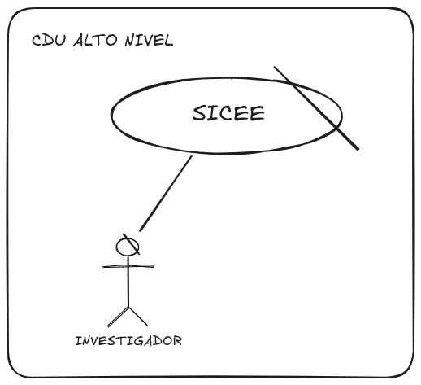
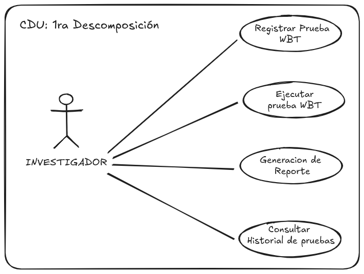
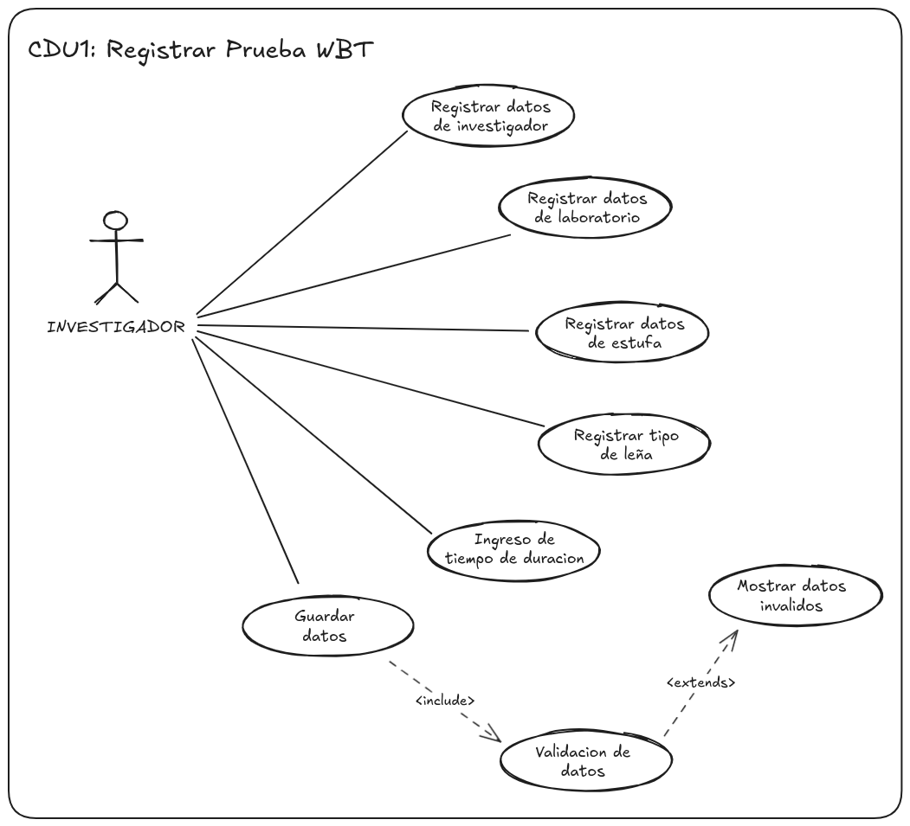
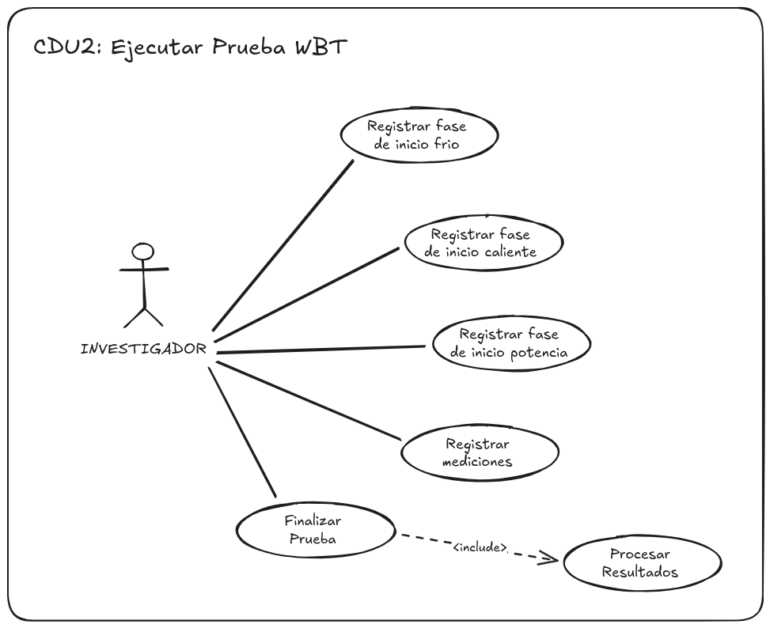
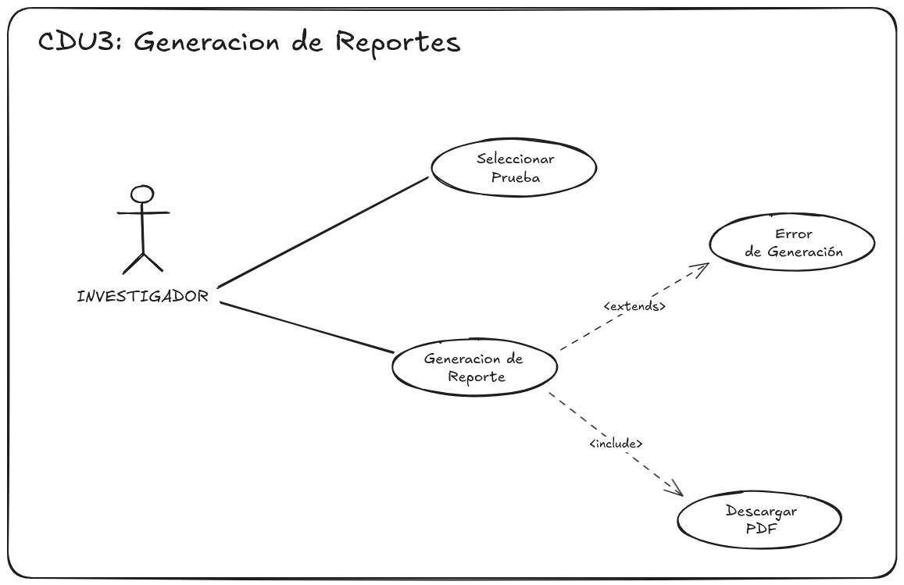
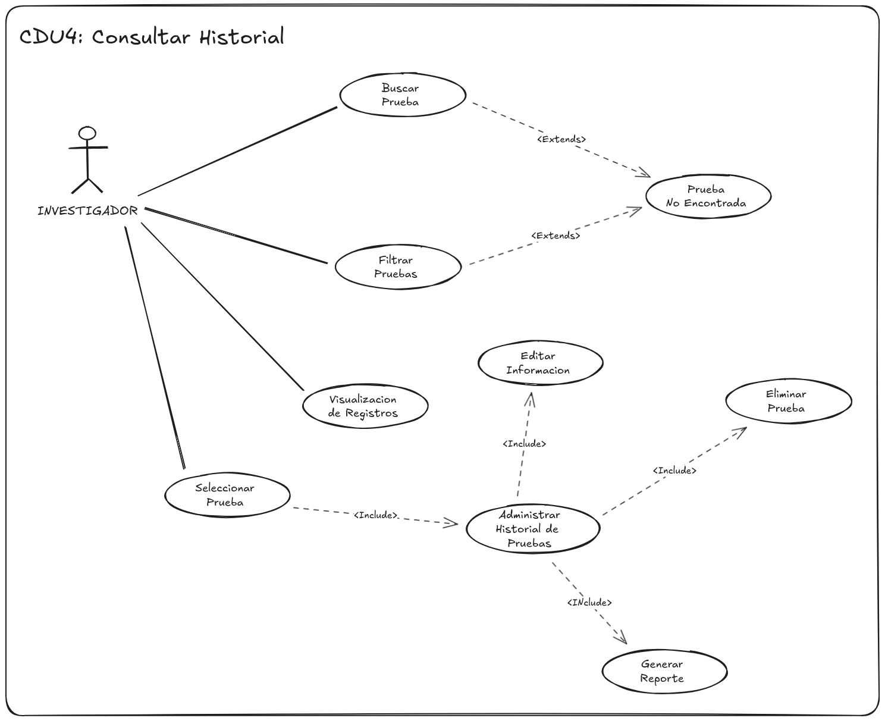

# SICEE - Sistema INtegrado de Caracterizacion Energetica y Emisiones

## Analisis del negocio

**Contexto del negocio**

El centro de Investigacion de Ingenieria (CII) de la facultad de Ingenieria de la Universidad de San Carlos de Guatemala (USAC) es el centro de servicios de investigacion y asesoria tecnica de la facultad. Su función principal es proveer servicios de alta calidad cientifico-tecnologica a los distintos sectores de la sociedad guatemalteca, actuando como puente entre la academia y la insdustria a través de ensayos, analisis y asesoria especializada.
 El CII organiza sus servicios en secciones especializadas, cada una enfocada en un area especifica de la ingenieria y atendida por profesionales con experiencia técnica en la materia: 

* Agregados, Concretos y Morteros
* Mecánica de Suelos y Asfaltos
* Metales y Productos Manufacturados
* Tecnología de la Madera
* Química Industrial
* Topografía y Catastro
* Centro de Información a la Construcción
* Ecomateriales
* Gestión de la Calidad
* Gestión Ambiental
* Estructuras
* Metrología
* Tecnología de los Materiales y Sistemas

Entre su cartera de clientes se encuentran empresas reconocidas del sector industria y de construcción guatemalteco, como Aceros de Guatemala, Cemsur, Grupo ITM y Conasa, entre otras.

**Descripcion del problema**

Actualmente, este tipo de ensayos —eficiencia térmica y emisiones— se gestionan de manera manual, principalmente mediante hojas de cálculo (Excel), lo que genera limitaciones en cuanto a trazabilidad, estandarización de resultados, generación de reportes y explotación posterior de los datos recolectados. Esto representa una oportunidad para el desarrollo de una plataforma que digitalice y sistematice dicho flujo de trabajo, mejorando la calidad, consistencia y disponibilidad de la información generada por el área de Tecnología de la Madera.

**Diagrama de Contexto**

## Drivers de calidad
---

|ID        | Categoria      | SubCategoria                     | Escenario | Prioridad |
|----------|----------------|----------------------|-----------|-----------|
|**EAC-01**| 
 Usabilidad 
    | Aprendizaje | **Fuente de estimulos:** Investigador   **Estímulo:** Necesita generar una prueba de ebullicion por primera vez   **Artefacto:** Modulo de ingreso de datos   **Ambiente:** Primera sesion de uso, sin capacitacion previa.   **Respuesta:** El investigador completa el registro guiándose por etiquetas claras y validación en tiempo real, sin necesidad de asistencia externa   **Medida de la respuesta:** Completa el ingreso en menos de 1 minuto y sin errores de validación en el primer intento | 
 Alta 
 |
|**EAC-02**| 
 Eficiencia 
 | Comportamiento   en el tiempo | **Fuente de estimulos:** Investigador   **Estímulo:** Revisar resultados de pruebas anteriores    **Artefacto:** Módulo de consulta de historial de pruebas   **Ambiente:** Operacion normal del sistema   **Respuesta:** Mostrar el listado de pruebas anteriores, Hasta 500 registros almacenados. Ordenados por fecha de realizacion.   **Medida de la respuesta:** En menos de 3 segundos. | 
 Alta 
  |
|**EAC-03**| 
 Mantenibilidad 
 | Facilidad de análisis            | **Fuente de estimulos:** Equipo de Desarrollo   **Estímulo:** Un componente del sistema presenta un bug   **Artefacto:** Código fuente del endpoint afectado   **Ambiente:** Sistema en produccion, con documentacion tecnica   **Respuesta:** El desarrollador identifica el módulo y la causa raíz del problema mediante logs, nomenclatura clara del código y documentación técnica, sin necesidad de revisar módulos no relacionados   **Medida de la respuesta:** Se localiza el problema en un tiempo no mayor a 30 minutos | 
 Alta 
 |
|**EAC-04**| 
 Fiabilidad 
 | Tolerancia a fallos | **Fuente de estimulos:** Investigador   **Estímulo:** Se solicita la generacion de un reporte pero ocurre una interrupcion a mitad del proceso.    **Artefacto:** Modulo de creación de reportes.   **Ambiente:** Operacion normal del sistema   **Respuesta:** El sistema detecta interrupciones en el servidor y no genera reporte incompleto o corrupto, da la opcion de intentar volver a generarlo.   **Medida de la respuesta:** El sistema se recupera y da la opcion de reintentar en menos de 30 segundos. |   Alta |
|**EAC-05**| 
 Eficiencia 
 | Comportamiendo   de recursos  | **Fuente de estimulos:** Multiples Investigadores   **Estímulo:** Uso simultaneo del sistema en horario laboral   **Artefacto:** Servidor de aplicacion   **Ambiente:** Operacion normal del sistema   **Respuesta:** El sistema atiende varias solicitudes de forma concurrente sin degradar el rendimiento   **Medida de la respuesta:**  Uso de cpu y memoria se mantienen por debajo del 80% con hasta 10 usuarios concurrentes| Media |
|**EAC-06**| 
 Funcionalidad 
 | Cumplimiento |**Fuente de estimulos:** Investigador   **Estímulo:** Solicita la generacion de un reporte de la prueba WBT.   **Artefacto:** Modulo de creacion de reportes   **Ambiente:** Generacion de reportes sobre pruebas realizadas  **Respuesta:** El sistema genera el reporte respetando el formato y los campos exigidos por el estándar de la prueba WBT.   **Medida de la respuesta:** reporte se genera en menos de 10 minutos, cumpliendo el 100% de los campos requeridos por el formato| Media |

## Requerimientos Funcionales y No funcionales
---

**Requerimientos Funcionales**

| ID        | Descripcion | Prioridad |
|-----------|-------------|-----------|
| **RF-01** | El sistema debe permitir al investigador registrar los datos de una prueba de ebullicion (WBT). | Alta |
| **RF-02** | El sistema debe permitir la visualizacion el historial de pruebas realizadas con anterioridad. | Alta |
| **RF-03** | El sistema debe permitir generar reportes en formato pdf de las pruebas realizadas. | Alta |
| **RF-04** | El sistema debe permitir ingresar datos de investigador. | Media |
| **RF-05** | El sistema debe permitir generar graficas dependiendo de las lecturas|  |  

**Requerimientos No Funcionales**

| ID         | Descripcion | Prioridad |
|------------|-----------|-------------|
| **RNF-01** | El sistema debe estar disponible durante horario normal de labores ( de 8 a 16 hrs.)| Alta |
| **RNF-02** | El sistema debe mostrar el historial en un tiempo no mayor a 3 segundos | Media |
| **RNF-03** | El sistema debe permitir reintentar la generación de un reporte en menos de 30 segundos tras una interrupción| Media |

## Casos de Uso
---

#### **CDU Alto Nivel: Core del negocio**

#### **CDU Alto NIvel: Primera Descomposición**

---
### CDU 1: Registrar prueba WBT

### CDU 2: Ejecutar Prueba WBT

### CDU 3: Generacion de Reportes

### CDU 4: Consultar Historial
